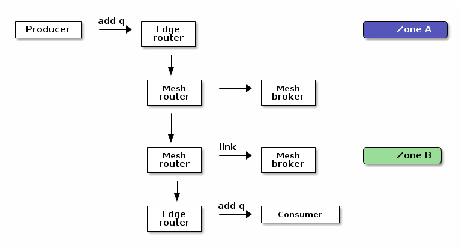
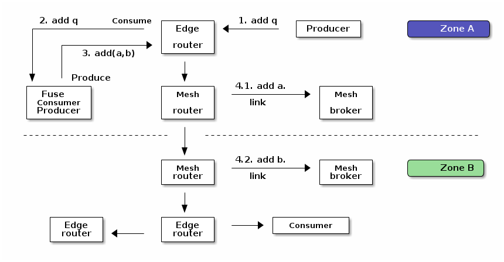

:source-highlighter: highlightjs
:data-uri:
:toc: left
:markup-in-source: +verbatim,+quotes,+specialcharacters
:icons: font
:stylesdir: stylesheets
:stylesheet: colony.css

= Amq Interconnect Mesh Demo
:data-uri:

:toc:
:toc-title: Blog Contents
:toclevels: 5

.*References:*
** https://github.com/apache/qpid-dispatch/blob/0.6.0/doc/book/link_routing.rst[]
** https://dzone.com/articles/routing-mechanisms-for-amqp-protocol[]
** https://access.redhat.com/documentation/en-us/red_hat_amq/7.7/html-single/using_the_amq_jms_client/index[]
** https://access.redhat.com/documentation/en-us/red_hat_amq/2021.q1/html/using_amq_interconnect/index[]
** https://qpid.apache.org/releases/qpid-dispatch-1.15.0/user-guide/index.html[]
** https://qpid.apache.org/releases/qpid-dispatch-1.15.0/man/qdrouterd.conf.html[]
** https://access.redhat.com/documentation/en-us/red_hat_fuse/7.8/html-single/fuse_on_openshift_guide/index

.*Sample Code:*
** https://github.com/rahmed-rh/jms-amqp-demo[]

== Designing The Topology

Conceptually we have two public clouds, and we want to host a messaging middleware infrastructure on each cloud and link them together as a WAN messaging middleware.

So For that reason we need to look on how interconnect listening for incoming connections.
In the following code excerpt you can see two (2) listeners, each with different role.

[source,yaml]
----
...
listener {
    host: 0.0.0.0
    port: amqps
    sslProfile: client_tls
    requireSsl: true
    authenticatePeer: yes
    saslMechanisms: EXTERNAL PLAIN
    role: normal <1>
    idleTimeoutSeconds: 0
    messageLoggingComponents: all
}
listener {
    host: 0.0.0.0
    port: 55677
    sslProfile: inter_router_tls
    authenticatePeer: yes
    requireSsl: true
    saslMechanisms: EXTERNAL PLAIN
    role: inter-router <1>
    policyVhost: inter-router
}
...
----
<1> role (One of [normal, inter-router, route-container, edge]). The role of an established connection.
In the normal role, the connection is assumed to be used for AMQP clients that are doing normal message delivery over the connection.
In the inter-router role, the connection is assumed to be to another router in the network. Inter-router discovery and routing protocols can only be used over inter-router connections.

So we have two options here; either

. We connect routers to each other for the purposes of forming *one global* network, through Inter-router connection/listener.
. We connect routers to each other as two *separate* networks that see each other merely as external AMQP services, through normal(amqps) connection/listener. This setup can be useful in case each environment will be managed independently.

So lets see the configuration of both setups,

. connect routers to each other for the purposes of forming *one global* network, through Inter-router connection/listener.
+
We have the interconnect router listener on port 55677
+
.overlays/zoneB/interconnect/mesh/cm.yaml
[source,yaml]
----
...
listener {
    host: 0.0.0.0
    port: 55677
    sslProfile: inter_router_tls
    authenticatePeer: yes
    requireSsl: true
    saslMechanisms: EXTERNAL PLAIN
    role: inter-router
    policyVhost: inter-router
}
...
----
+
Then we expose this port on both the deploymentConfig & Service
+
.base/interconnect/mesh/dc.yaml
[source,yaml]
----
...
spec:
  serviceAccountName: amq-interconnect-mesh
  terminationGracePeriodSeconds: 60
  containers:
  - name: "amq-interconnect"
    image: registry.redhat.io/amq7/amq-interconnect:latest
    ports:
    ...
    - name: inter-ext
      containerPort: 55677
      protocol: TCP
...
----
+
.base/interconnect/mesh/svc.yaml
[source,yaml]
----
...
spec:
  ports:
  ...
  - port: 55677
    name: inter-router-external
    targetPort: 55677
...
----
+
Then expose this port externally through a route
+
.base/interconnect/mesh/route-inter-router.yaml
[source,yaml]
----
kind: Route
apiVersion: route.openshift.io/v1
metadata:
  name: amq-mesh-inter-router
spec:
  port:
    targetPort: 55677
  tls:
    termination: passthrough
  to:
    kind: Service
    name: amq-interconnect-mesh
----
+
The last thing is to connect through connector from other Zone to this route
+
.overlays/zoneA/interconnect/mesh/cm.yaml
[source,yaml]
----
...
connector {
    name: remote-amq-mesh-inter-router-route
    host: amq-mesh-inter-router-broker-with-interconnect-mesh.apps.y3tpfd3p.westeurope.aroapp.io
    port: 443
    saslMechanisms: EXTERNAL PLAIN

    sslProfile: inter_router_tls
    saslUsername: remote_connection@amq-interconnect-mesh
    saslPassword: passw0rd

    role: inter-router
    verifyHostname: false
    idleTimeoutSeconds: 0
    messageLoggingComponents: all
}
...
----

. connect routers to each other as two *separate* networks that see each other merely as external AMQP services, through normal(amqps) connection/listener. This setup can be useful in case each environment will be managed independently.
+
We have the interconnect router listener on port amqps (5671)
+
.overlays/zoneB/interconnect/mesh/cm.yaml
[source,yaml]
----
...
listener {
    host: 0.0.0.0
    port: amqps
    # sslProfile: service_tls
    sslProfile: client_tls
    requireSsl: true
    authenticatePeer: yes
    saslMechanisms: EXTERNAL PLAIN
    idleTimeoutSeconds: 0
    messageLoggingComponents: all
}
----
+
Then we expose this port on both the deploymentConfig & Service
+
.base/interconnect/mesh/dc.yaml
[source,yaml]
----
...
spec:
  serviceAccountName: amq-interconnect-mesh
  terminationGracePeriodSeconds: 60
  containers:
  - name: "amq-interconnect"
    image: registry.redhat.io/amq7/amq-interconnect:latest
    ports:
    ...
    - name: amqps
      containerPort: 5671
      protocol: TCP
...
----
+
.base/interconnect/mesh/svc.yaml
[source,yaml]
----
...
spec:
  ports:
  ...
  - port: 5671
    name: amqps
    targetPort: 5671
...
----
+
Then expose this port externally through a route
+
.base/interconnect/mesh/route-amqps.yaml
[source,yaml]
----
kind: Route
apiVersion: route.openshift.io/v1
metadata:
  name: amq-mesh-amqps
spec:
  port:
    targetPort: amqps
  tls:
    termination: passthrough
  to:
    kind: Service
    name: amq-interconnect-mesh
----
+
The last thing is to connect through connector from other Zone to this route
+
.overlays/zoneA/interconnect/mesh/cm.yaml
[source,yaml]
----
...
connector {
    name: remote-amq-mesh-amqps-route
    host: amq-mesh-amqps-broker-with-interconnect-mesh.apps.y3tpfd3p.westeurope.aroapp.io
    port: 443
    saslMechanisms: EXTERNAL PLAIN

    sslProfile: client_tls
    saslUsername: remote_connection@amq-interconnect-mesh
    saslPassword: passw0rd

    role: route-container
    verifyHostname: false
    idleTimeoutSeconds: 0
    messageLoggingComponents: all
}
...
----

For the purpose of this PoC, we will use both connection/listener in different usecases, just to showcases.

== Deploy Infrastructure

In the next section, I'm going to explain how to deploy the demo Infrastructure which is using two (2) public clouds.

First Step is to generate the Certificates, which will need to secure the communication between different components for this we will do the following

=== Generate Common CA Certs

We start by generating a common CA Cert which we will use to sign all internal routers certificates, in different clusters/zones.

[source,bash]
----
$ cd amq-interconnect-mesh-demo/overlays
$ ./generate-crts.sh

$ ll crt/ca-certs/
total 16
-rw-rw-r--. 1 rahmed rahmed 1192 Mar 12 10:19 ca.crt
-rw-rw-r--. 1 rahmed rahmed  993 Mar 12 10:19 ca-csr.pem
-rw-------. 1 rahmed rahmed 1675 Mar 12 10:19 ca-key.pem
-rw-------. 1 rahmed rahmed 1675 Mar 12 10:19 tls.key
----

=== Generate Interconnect Certificates for each Zone
Now, for each Zone/Cluster we will generate certificates for Interconnect.

We need two (2) kind of certificates;

* The Internal Router certificate, which the router will use to take to its peer routers (interior,edge) to form a routers mesh
* The Client/Service Certificate (AMQPs), which will be exposed to clients (internal within OpenShift, or external outside OpenShift) trying to connect to server.

The bash script generate both certificates in one go.

[[link-internal-router-cert]]
==== The Internal Router certificate

We will start by generating the Internal router certificates.

Start by ZoneA

[source,bash]
----
$ cd overlays/zoneA/interconnect
$ ./generate-crts.sh

$ ll crt/
client-certs/   internal-certs/

$ ll internal-certs/
total 24
-rw-rw-r--. 1 rahmed rahmed 1192 Mar 12 10:39 ca.crt
-rw-------. 1 rahmed rahmed 1675 Mar 12 10:39 ca-key.pem
-rw-rw-r--. 1 rahmed rahmed   41 Mar 12 10:39 ca.srl
-rw-rw-r--. 1 rahmed rahmed 1281 Mar 12 10:39 server-csr.pem
-rw-rw-r--. 1 rahmed rahmed 1147 Mar 12 10:39 tls.crt
-rw-------. 1 rahmed rahmed 1675 Mar 12 10:39 tls.key

----

then, the same for ZoneB

[source,bash]
----
$ cd overlays/zoneB/interconnect
$ ./generate-crts.sh

$ ll crt/
client-certs/   internal-certs/

$ ll crt/internal-certs/
total 24
-rw-rw-r--. 1 rahmed rahmed 1192 Mar 12 10:43 ca.crt
-rw-------. 1 rahmed rahmed 1675 Mar 12 10:43 ca-key.pem
-rw-rw-r--. 1 rahmed rahmed   41 Mar 12 10:43 ca.srl
-rw-rw-r--. 1 rahmed rahmed 1253 Mar 12 10:43 server-csr.pem
-rw-rw-r--. 1 rahmed rahmed 1147 Mar 12 10:43 tls.crt
-rw-------. 1 rahmed rahmed 1675 Mar 12 10:43 tls.key

----

==== The Client/Service Certificate (AMQPs)

As mentioned the Client/Service Certificate is for serving Client connecting on AMQPs so it should contain

* Service Url for clients connecting from inside the OpenShift Cluster
* Route Url for clients connecting from outside the OpenShift Cluster

We will generate the Certificate where the CN is the Service Url, and the additional SANs are the Routes Urls
To customize the Urls (you will need to adjust the svc and route urls to match your environment),

[source,bash]
----
AMQ_INTERCONNECT_SVC_URL=*.broker-with-interconnect-mesh.svc.cluster.local
AMQ_INTERCONNECT_ROUTE_URL=DNS:amq-interconnect-edge-console-broker-with-interconnect-mesh.apps.cluster-f037.gcp.testdrive.openshift.com,DNS:amq-interconnect-mesh-console-broker-with-interconnect-mesh.apps.cluster-f037.gcp.testdrive.openshift.com
----

Also As mentioned before, the bash script generate both certificates (Internal Router, Client/Service) in one go.
So from the previous step <<link-internal-router-cert,internal router certificate>> the Client/Service Certificate should also be generated

[source,bash]
----
$ cd overlays/zoneA/interconnect

$ ll crt/
client-certs/   internal-certs/

$ ll crt/client-certs/
total 20
-rw-rw-r--. 1 rahmed rahmed 1131 Mar 12 10:31 client.der
-rw-rw-r--. 1 rahmed rahmed 2823 Mar 12 10:31 client.ks
-rw-rw-r--. 1 rahmed rahmed    9 Mar 12 10:31 password.txt
-rw-rw-r--. 1 rahmed rahmed 1586 Mar 12 10:31 tls.crt
-rw-------. 1 rahmed rahmed 1679 Mar 12 10:31 tls.key
----

then, also check ZoneB

[source,bash]
----
$ cd overlays/zoneB/interconnect

$ ll crt/
client-certs/   internal-certs/

$ ll crt/client-certs/
total 20
-rw-rw-r--. 1 rahmed rahmed 1107 Mar 12 10:43 client.der
-rw-rw-r--. 1 rahmed rahmed 2799 Mar 12 10:43 client.ks
-rw-rw-r--. 1 rahmed rahmed    9 Mar 12 10:43 password.txt
-rw-rw-r--. 1 rahmed rahmed 1554 Mar 12 10:43 tls.crt
-rw-------. 1 rahmed rahmed 1675 Mar 12 10:43 tls.key
----

The we need to Copy tls.crt from ZoneA as ca.crt in ZoneB and vice versa,
so they can trust each other incase we need to talk on Client/Service exposed ocp route.

[source,bash]
----
$ cp overlays/zoneB/interconnect/crt/client-certs/tls.crt overlays/zoneA/interconnect/crt/client-certs/ca.crt
$ cp overlays/zoneA/interconnect/crt/client-certs/tls.crt overlays/zoneB/interconnect/crt/client-certs/ca.crt

$ ll overlays/zoneA/interconnect/crt/client-certs/
total 24
-rw-rw-r--. 1 rahmed rahmed 1700 Mar 13 20:37 ca.crt
-rw-rw-r--. 1 rahmed rahmed 1246 Mar 12 13:10 client.der
-rw-rw-r--. 1 rahmed rahmed 2943 Mar 12 13:10 client.ks
-rw-rw-r--. 1 rahmed rahmed    9 Mar 12 13:10 password.txt
-rw-rw-r--. 1 rahmed rahmed 1744 Mar 12 13:10 tls.crt
-rw-------. 1 rahmed rahmed 1675 Mar 12 13:10 tls.key

$ ll overlays/zoneB/interconnect/crt/client-certs/
total 24
-rw-rw-r--. 1 rahmed rahmed 1744 Mar 13 20:37 ca.crt
-rw-rw-r--. 1 rahmed rahmed 1213 Mar 12 13:11 client.der
-rw-rw-r--. 1 rahmed rahmed 2911 Mar 12 13:11 client.ks
-rw-rw-r--. 1 rahmed rahmed    9 Mar 12 13:11 password.txt
-rw-rw-r--. 1 rahmed rahmed 1700 Mar 12 13:11 tls.crt
-rw-------. 1 rahmed rahmed 1675 Mar 12 13:11 tls.key

----

[source,bash]
----
kustomize build overlays/zoneA | oc apply -f -
kustomize build overlays/zoneB | oc apply -f -

----

[[link-message-routing]]
== Message Routing
With the message-routing strategy, each router makes a routing decision on a per-message basis when the message is delivered.

When the router receives a message on a link, it uses the address specified by the sender attached the link itself to the route;
if this address wasn’t specified, the destination address is get from the 'To' property of the message.
Based on such information, the router inspects its routing table to determine the route for delivering the message.
It could be a link attached by a direct receiver to the router or another router inside the network that will be the next hop for reaching the destination.
Of course, the message could be sent to different receivers all interested in the same address.
The main point here is that the routing decision is made for each received message and there is always a
communication between internal router nodes and external clients.

IMPORTANT: You can't use wildcard destination address with auto-links, auto-links address should be an explicit destination name.

=== What is waypoint ?

Waypoint - feature is intended for address hosted on some external 'waypoint', usually a broker.
So every message goes to a broker first then comes out of the broker to resend to the receiver (so there’s going to be some latency added by that process).

Setting waypoint as true will cause the proper <<link-what-phases, address-phasing>> to be used for the producer and consumer.
This will simplify the phase defaults in autolinks.

[[link-what-phases]]
=== What are phases in autolinks ?

Phase 0 is for routing deliveries (messages) from producers to the tail of the queue (the out auto-link associated with the queue).
Phase 1 is for routing deliveries (messages) from the head of the queue to subscribed consumers (the in auto-link associated with the queue).

So In cases you want two (2) addresses pointing to the same queue, Where you want a distinct address for consuming and another for producing.
You can define

[source,yaml]
----
address {
      prefix: rh.usecase.1.producer
      distribution: closest
    }
address {
        prefix: rh.usecase.1.consumer
        distribution: closest
    }

autoLink {
    address: rh.usecase.1.producer
    connection: mesh-amq-broker
    dir: out
    phase: 0
    externalAddr: rh.usecase.1.queue::rh.usecase.1.queue
    }

autoLink {
    address: rh.usecase.1.consumer
    connection: mesh-amq-broker
    dir: in
    phase: 1
    externalAddr: rh.usecase.1.queue::rh.usecase.1.queue
    }

----

=== Message Disposition (Acknowledgment)footnote:[https://access.redhat.com/documentation/en-us/red_hat_amq/7.7/html-single/using_amq_interconnect/index#understanding-message-routing-router-rhel]

Another interesting point related to the message routing is Disposition (Acknowledgment).

The level of reliability is negotiated between the client and the router when establishes a link to the router.
To achieve the negotiated level of reliability, AMQ Interconnect treats all messages as either pre-settled or unsettled.

==== Pre-settled

The router always propagates the delivery (message) and its settlement along the network.
On receiving a “pre-settled” message, it propagates the settlement to the message’s destination. However, it does not guarantee delivery.

Similar to https://activemq.apache.org/components/artemis/documentation/latest/pre-acknowledge.html[Artemis PRE_ACKNOWLEDGE], where messages will be acknowledge
on the server *before* being delivered to the client.

So, if you set Pre-settled for consumers then in AMQP land the router sends the messages to destination as settled,
meaning that the client doesn't need to send back a response as the router has already forgotten about the message.
That is why it is called "fire and forget".

==== Unsettled

Also the router propagates the delivery (message) and its settlement along the network.
for “unsettled” messages, the router needs to track the incoming delivery (message) and send the unsettled message to the destination;
when it will receive the disposition (settlement) from the final receiver, it will reply in the same way to the original sender.
This is a bit more complex in case of a multicast address, the router associates the incoming delivery with all outbound deliveries.
The router waits for each consumer to set their delivery’s final state.
After all outgoing deliveries have reached their final state, the router sets a final delivery state for the original inbound delivery and passes it to the producer.

The following table describes the reliability guarantees for unsettled messages sent to an anycast or multicast address:

[%header,cols="1,2,2"]
|===
|Final disposition
|Anycast
|Multicast

|accepted
|The consumer accepted the message.
|At least one consumer accepted the message, but no consumers rejected it.

|released
|The message did not reach its destination.
|The message did not reach any of the consumers.

|modified
|The message may or may not have reached its destination.
The delivery is considered to be "in-doubt" and should be re-sent if "at least once" delivery is required.
|The message may or may not have reached any of the consumers. However, no consumers rejected or accepted it.

|rejected
|The consumer rejected the message.
|At least one consumer rejected the message.

|===

==== Mapping Message Disposition to JMS Acknowledgmentfootnote:[https://access.redhat.com/documentation/en-us/red_hat_amq/7.7/html-single/using_the_amq_jms_client/index#connection_uri_options_jms]

Ok so as explained <<Message Disposition (Acknowledgment)>> AMQP have two Disposition modes (Pre-settled, Unsettled), So when using the JMS Client this needs to be mapped to JMS modes (AUTO_ACKNOWLEDGE, CLIENT_ACKNOWLEDGE, DUPS_OK_ACKNOWLEDGE)

IMPORTANT: Those are global for the connection factory/connection.

* Redelivery policy options
+
Redelivery policy controls how redelivered messages are handled on the client.
+
** *jms.redeliveryPolicy.maxRedeliveries*
Controls when an incoming message is rejected based on the number of times it has been redelivered. A value of 0 indicates that no message redeliveries are accepted. A value of 5 allows a message to be redelivered five times, and so on. The default is -1, meaning no limit.
+
** *jms.redeliveryPolicy.outcome*
Controls the outcome applied to a message once it has exceeded the configured maxRedeliveries value. Supported values are: ACCEPTED, REJECTED, RELEASED, MODIFIED_FAILED and MODIFIED_FAILED_UNDELIVERABLE.
The default value is MODIFIED_FAILED_UNDELIVERABLE.
+
* Presettle policy options
+
Presettle policy controls when a producer or consumer instance will be configured to use AMQP presettled messaging semantics.
+
** *jms.presettlePolicy.presettleAll*
If enabled, all producers and non-transacted consumers created operate in presettled mode. It is disabled by default.

** *jms.presettlePolicy.presettleProducers*
If enabled, all producers operate in presettled mode. It is disabled by default.

** *jms.presettlePolicy.presettleTopicProducers*
If enabled, any producer that is sending to a Topic or TemporaryTopic destination will operate in presettled mode. It is disabled by default.

** *jms.presettlePolicy.presettleQueueProducers*
If enabled, any producer that is sending to a Queue or TemporaryQueue destination will operate in presettled mode. It is disabled by default.

** *jms.presettlePolicy.presettleTransactedProducers*
If enabled, any producer that is created in a transacted Session will operate in presettled mode. It is disabled by default.

** *jms.presettlePolicy.presettleConsumers*
If enabled, all consumers operate in presettled mode. It is disabled by default.

** *jms.presettlePolicy.presettleTopicConsumers*
If enabled, any consumer that is receiving from a Topic or TemporaryTopic destination will operate in presettled mode. It is disabled by default.

** *jms.presettlePolicy.presettleQueueConsumers*
If enabled, any consumer that is receiving from a Queue or TemporaryQueue destination will operate in presettled mode. It is disabled by default.

There are also another possibility to set it at a session level from JMS, so that such a connection can share both sessions with need pre-ack and sessions that need other modes.

https://access.redhat.com/documentation/en-us/red_hat_amq/7.7/html/using_the_amq_jms_client/message_delivery#extended_session_acknowledgment_modes[Extended session acknowledgment modes]

* Individual acknowledge
* No acknowledge

=== Usecase 1 - Message Routing: Produce to AnyCast queue in the broker
Produce and Consume messages to/from address on the edge broker, this address should be created inside the broker attached to the interior mesh.
The message routing auto-links should match an 'explicit' address inside the broker.

image::images/usecase-1.png[]

So the flow will be from Edge Router -> Mesh -> Broker

As you can see, a link is established between producer and edge router and between edge router and consumer.
They are two completely distinct links (dir: out, dir: in) that the router uses for messages exchange between producer and consumer
through the routing mechanism on message basis.

It means that there is a different flow control between router (with its internal receiver - broker in our case) and Producer,
and between router (with its internal sender - also broker in our case) and Consumer.

[NOTE]
====
The default routing type to be used if not specified by the client is MULTICAST.
To create anycast addresses we will need an addressSettings on the broker that matches the destination address name.
Like the following

.overlays/zoneA/broker/mesh/broker.yaml
[source,yaml]
----
apiVersion: broker.amq.io/v2alpha4
kind: ActiveMQArtemis
metadata:
  name: mesh-broker
spec:
  ...
  addressSettings:
    applyRule: replace_all
    addressSetting:
    - match: '#'
      ...
      autoCreateAddresses: true
      autoDeleteAddresses: false

      autoCreateJmsQueues: true
      autoDeleteJmsQueues: false
      autoCreateJmsTopics: true
      autoDeleteJmsTopics: false
      autoCreateQueues: true
      autoDeleteQueues: true

      # The default routing type to be used if not specified by the client is MULTICAST.
      defaultAddressRoutingType: ANYCAST
      defaultQueueRoutingType: ANYCAST

----

====

lets see the qpid config

.overlays/zoneA/interconnect/edge/cm.yaml
[source,yaml]
----
...
address {
    prefix: rh.usecase.1.queue
    distribution: closest
}
...
----

.overlays/zoneA/interconnect/mesh/cm.yaml
[source,yaml]
----
...
address {
    prefix: rh.usecase.1.queue
    waypoint: yes
    distribution: closest

}
autoLink {
  address: rh.usecase.1.queue
  connection: zone-a-mesh-amq-broker
  dir: out
}
autoLink {
  address: rh.usecase.1.queue
  connection: zone-a-mesh-amq-broker
  dir: in
}
...
----

Now lets see the client code

[source,java]
----
/* Test for Usecase message routing */
String usecase1ProducerQueueName="rh.usecase.1.queue";
String usecase1ConsumerQueueName="rh.usecase.1.queue";
JMSProducer usecase1QueueProducer = new JMSProducer(connectionFactory1, usecase1ProducerQueueName,false);
JMSQueueConsumer usecase1QueueConsumer1 = new JMSQueueConsumer(connectionFactory1,usecase1ConsumerQueueName,"Consumer-1");

// The interconnect will create a queue "rh.group.1.queue::rh.group.1.queue" in the broker through autolinks
// We will generate 10 connection on the edge, those will not reflect on the broker.
// Only 2 connection (1 for producer & 1 for consumer) will be created on broker

Executor usecase1QueueExecutor = Executors.newFixedThreadPool(20);

// Generate 10 Producers on queue
for (int i=0;i<10;i++)
usecase1QueueExecutor.execute(usecase1QueueProducer);

// Generate 10 Consumers on queue.
for (int i=0;i<10;i++)
	usecase1QueueExecutor.execute(usecase1QueueConsumer1);
----

=== Usecase 2 - Message Routing: Produce to AnyCast queue with multicast distribution across zones
Produce messages to address on the edge broker in zone A,
then using message routing logic message message should be delivered to an address created inside the broker attached to the interior mesh,
and propagated to zone B and fan put to q1,q2 address created inside the broker attached to the interior mesh in zone B.

image::images/usecase-2.png[]

So the flow will be from Edge Router (Zone A) -> Mesh Router (Zone A) *multicast*-> Mesh Broker (Zone A) && Mesh Router (Zone B) *multicast*-> Mesh Broker (q1 && q2) -> Edge Router (q1, q2)

lets see the qpid config

.overlays/zoneA/interconnect/edge/cm.yaml
[source,yaml]
----
...
address {
    prefix: rh.usecase.2.queue
    distribution: closest
}
...
----

.overlays/zoneA/interconnect/mesh/cm.yaml
[source,yaml]
----
...
address {
    prefix: rh.usecase.2.queue
    waypoint: yes
    # I want to distribute messages to both local mesh-broker & remote mesh
    distribution: multicast
}
# broker autolinks, both dir (in, out)
autoLink {
    address: rh.usecase.2.queue
    connection: zone-a-mesh-amq-broker
    direction: out
}
autoLink {
    address: rh.usecase.2.queue
    connection: zone-a-mesh-amq-broker
    direction: in
}
...
----

.overlays/zoneB/interconnect/mesh/cm.yaml
[source,yaml]
----
...
address {
    prefix: rh.usecase.2.queue
    distribution: multicast
}
# broker autolinks, one dir (out)
autoLink {
    address: rh.usecase.2.queue
    connection: zone-b-mesh-amq-broker
    direction: out
    phase: 0
    externalAddress: rh.usecase.2.queue.q1::rh.usecase.2.queue.q1
}
autoLink {
    address: rh.usecase.2.queue
    connection: zone-b-mesh-amq-broker
    direction: out
    phase: 0
    externalAddress: rh.usecase.2.queue.q2::rh.usecase.2.queue.q2
}

address {
    prefix: rh.usecase.2.q1
    waypoint: true
    distribution: closest
}
autoLink {
    address: rh.usecase.2.q1
    connection: zone-b-mesh-amq-broker
    direction: in
    externalAddress: rh.usecase.2.queue.q1::rh.usecase.2.queue.q1
}

address {
    prefix: rh.usecase.2.q2
    waypoint: true
    distribution: closest
}
autoLink {
    address: rh.usecase.2.q2
    connection: zone-b-mesh-amq-broker
    direction: in
    externalAddress: rh.usecase.2.queue.q2::rh.usecase.2.queue.q2
}
...
----

.overlays/zoneB/interconnect/edge/cm.yaml
[source,yaml]
----
...
address {
    prefix: rh.usecase.2.q1
    distribution: closest
}
address {
    prefix: rh.usecase.2.q2
    distribution: closest
}
...
----

Now lets see the client code

[source,java]
----
JmsConnectionFactory connectionFactory1 = new JmsConnectionFactory();
connectionFactory1.setRemoteURI(
	String.format("%s?%s", zoneAUrl, "transport.verifyHost=false&transport.trustAll=true&amqp.saslMechanisms=SCRAM-SHA-1&amqp.idleTimeout=120000&amqp.traceFrames=true"));
connectionFactory1.setUsername("admin@amq-interconnect-edge");
connectionFactory1.setPassword("admin");

JmsConnectionFactory connectionFactory2 = new JmsConnectionFactory();
connectionFactory2.setRemoteURI(
	String.format("%s?%s", zoneBUrl, "transport.verifyHost=false&transport.trustAll=true&amqp.saslMechanisms=SCRAM-SHA-1&amqp.idleTimeout=120000&amqp.traceFrames=true"));
connectionFactory2.setUsername("admin@amq-interconnect-edge");
connectionFactory2.setPassword("admin");

String usecase2ProducerQueueName="rh.usecase.2.queue";
String usecase2Consumer1QueueName="rh.usecase.2.q1";
String usecase2Consumer2QueueName="rh.usecase.2.q2";

JMSProducer usecase2QueueProducer = new JMSProducer(connectionFactory1, usecase2ProducerQueueName,false);
JMSQueueConsumer usecase2QueueConsumer1 = new JMSQueueConsumer(connectionFactory2,usecase2Consumer1QueueName,"Consumer-1");
JMSQueueConsumer usecase2QueueConsumer2 = new JMSQueueConsumer(connectionFactory2,usecase2Consumer2QueueName,"Consumer-2");

Executor usecase2QueueExecutor = Executors.newFixedThreadPool((consumerCount*2)+producerCount);

// Generate 10 Producers on queue
for (int i=0;i<producerCount;i++)
	usecase2QueueExecutor.execute(usecase2QueueProducer);

// Generate 2 Consumers on each queue(q1,q2).
for (int i=0;i<consumerCount;i++)
	usecase2QueueExecutor.execute(usecase2QueueConsumer1);

for (int i=0;i<consumerCount;i++)
	usecase2QueueExecutor.execute(usecase2QueueConsumer2);
----

[NOTE]
====
One Important note, is how we link ZoneA router mesh with ZoneB router mesh.
To create this link, we need to create a connector from ZoneA router mesh to the 'amqps port' exposed through route in ZoneB router mesh.
lets check the connection 'remote-amq-mesh', which points to ZoneB router mesh

.overlays/zoneA/interconnect/mesh/cm.yaml
[source,yaml]
----
connector {
    name: remote-amq-mesh
    host: amq-interconnect-mesh-amqps-broker-with-interconnect-mesh.apps.y3tpfd3p.westeurope.aroapp.io
    port: 443 <1>
    saslMechanisms: EXTERNAL PLAIN

    sslProfile: client_tls
    saslUsername: remote_connection@amq-interconnect-mesh
    saslPassword: passw0rd

    role: route-container <2>
    # role: inter-router
    verifyHostname: false
    idleTimeoutSeconds: 0
    messageLoggingComponents: all
}
----
<1> Using amqps (TLS using SNI), for more information about OpenShift 4 Ingress check https://docs.openshift.com/container-platform/4.6/networking/configuring_ingress_cluster_traffic/overview-traffic.html[Configuring ingress cluster traffic overview]
<2> role must be route-container, connecting with role 'inter-router' will cause any auto-link using connection 'remote-amq-mesh' to be inactive.

====

== Link Routing
Link-routing is different than <<link-message-routing,message-routing strategy>> because it makes routing decisions when link-attach frames arrive.
A link is effectively chained across the network of routers from the establishing node to the destination node to establish the real link.
Once the link is established, the transfer of message deliveries, flow frames, and dispositions is performed across the routed link.

When the sender starts to send messages to the router, it propagates that message
through the established link to the destination without making any decision at the message level. You can think of it as a sort of virtual connection or a tunnel between sender and receiver through a router's network.

From a flow control point of view, it’s directly handled between sender and receiver;
The link through the router is like a “tunnel” and it seems that the two peers are directly connected.
The same is true for disposition about settlement for “unsettled” messages that the sender receives directly from the receiver.

The concept of different distribution (closest, balanced, multicast) patterns doesn’t make sense because in this case there is a direct link between sender and receiver
so the router doesn’t make any decision on single message basis but it has only to propagate the frame along the link.

=== Usecase 3 - Link Routing: Produce to AnyCast queue with wildcard address patterns across zones
Produce messages to address on the edge broker in zone A, this address is dynamic (using wild card matching)
then using link routing, message should propagated to zone B and address is created (the dynamic address name) inside the broker attached to the interior mesh in zone B.

So the flow will be from Edge Router (Zone A) -> Mesh Router (Zone A) -> Mesh Router (Zone B) -> Mesh Broker (Zone B) -> Edge Router (Zone B)

Please note in this usecase, the "linkRoute" defined in ZoneB will be discovered by the network through the inter-route connection.

lets see the qpid config

.overlays/zoneA/interconnect/edge/cm.yaml
[source,yaml]
----
...
address {
    prefix: rh.usecase.3.*
    distribution: closest
}
...
----

.overlays/zoneB/interconnect/mesh/cm.yaml
[source,yaml]
----
...
linkRoute {
  name: rh.usecase.3.in
  pattern: rh/usecase/3/*
  direction: in
  connection: zone-b-mesh-amq-broker
}
linkRoute {
  name: rh.usecase.3.out
  pattern: rh/usecase/3/*
  direction: out
  connection: zone-b-mesh-amq-broker
...
----

.overlays/zoneB/interconnect/edge/cm.yaml
[source,yaml]
----
...
address {
    prefix: rh.usecase.3.*
    distribution: closest
}
...
----

Now lets see the client code
[source,java]
----
JmsConnectionFactory connectionFactory1 = new JmsConnectionFactory();
connectionFactory1.setRemoteURI(
	String.format("%s?%s", zoneAUrl, "transport.verifyHost=false&transport.trustAll=true&amqp.saslMechanisms=SCRAM-SHA-1&amqp.idleTimeout=120000&amqp.traceFrames=true"));
connectionFactory1.setUsername("admin@amq-interconnect-edge");
connectionFactory1.setPassword("admin");

JmsConnectionFactory connectionFactory2 = new JmsConnectionFactory();
connectionFactory2.setRemoteURI(
	String.format("%s?%s", zoneBUrl, "transport.verifyHost=false&transport.trustAll=true&amqp.saslMechanisms=SCRAM-SHA-1&amqp.idleTimeout=120000&amqp.traceFrames=true"));
connectionFactory2.setUsername("admin@amq-interconnect-edge");
connectionFactory2.setPassword("admin");

String usecase3ProducerQueueName="rh.usecase.3.dummy";
String usecase3ConsumerQueueName="rh.usecase.3.dummy";

JMSProducer usecase3QueueProducer = new JMSProducer(connectionFactory1, usecase3ProducerQueueName,false);
JMSQueueConsumer usecase3QueueConsumer1 = new JMSQueueConsumer(connectionFactory2,usecase3ConsumerQueueName,"Consumer-1");

Executor usecase2QueueExecutor = Executors.newFixedThreadPool(consumerCount+producerCount);

// Generate Producers on any dummy queue, it should be auto-created
for (int i=0;i<producerCount;i++)
	usecase2QueueExecutor.execute(usecase3QueueProducer);

// Generate Consumers on the previously defined dummy queue
for (int i=0;i<consumerCount;i++)
	usecase2QueueExecutor.execute(usecase3QueueConsumer1);
----

=== Usecase 4 - Utilize Fuse (Camel) to implement more complex integration
So what is the problem we are trying to solve,
Basically we want to produce messages to broker in one region,
and messages transmitted to other brokers in other region *in order*.
The idea is we can have locality (affinity) of consumers (Consumers consumes from brokers in same region).

To solve this problem, I'm going to use two things;

. Fuse/Camel for linking systems together. Camel/Fuse is a versatile open-source integration
framework based on known Enterprise Integration Patterns (EIP).
Camel have many EIP components that makes linking/wiring systems much easier and avoid boilerplate code.
+
For this usecase we will use 2 components
+
.. https://access.redhat.com/documentation/en-us/red_hat_fuse/7.8/html-single/apache_camel_development_guide/index#MsgRout-RecipientList[Recipient List pattern]
.. https://access.redhat.com/documentation/en-us/red_hat_fuse/7.8/html/apache_camel_component_reference/gzip-dataformat[GZip message compression and de-compression]
+
. Link Routing so when Fuse produce, we will have ordered messages to brokers.

So let have a look at the message flow diagram

The idea is that the fuse is the AMQP consumer for the address "telemetry.cortex.train.window.applicatienaam1",
once message is recieved it will compress it (gzip) and produce it in parallel to two addresses "telemetry.cortex.train.window.applicatienaam1.zone-a", "telemetry.cortex.train.window.applicatienaam1.zone-b"

.https://raw.githubusercontent.com/rahmed-rh/jms-amqp-demo/main/fuse-amq-amqps-sample/src/main/java/com/redhat/demo/rahmed/AMQPDemo.java[src/main/java/com/redhat/demo/rahmed/AMQPDemo.java]
[source,java]
----
from(getSourceName())
		.routeId("route-from-queue-consumer").streamCaching().tracing()
			.log("Recieved Message ${body} from Address " + getSourceName())
		.marshal().gzip() // use gzip to compress the message text
		.setExchangePattern(ExchangePattern.InOnly)
		.recipientList() // distribute message to all recipients in parallel
			.constant(getDestinationName())
			.parallelProcessing()
			.log(String.format("Calling ${in.header.%s}", Exchange.RECIPIENT_LIST_ENDPOINT))

		.end();
----

.https://raw.githubusercontent.com/rahmed-rh/jms-amqp-demo/main/fuse-amq-amqps-sample/src/main/resources/application.properties[src/main/resources/application.properties]
[source,properties]
----
address.source-name=amqp:queue:telemetry.cortex.train.window.applicatienaam1
address.destination-name=amqp:queue:telemetry.cortex.train.window.applicatienaam1.zone-a,amqp:queue:telemetry.cortex.train.window.applicatienaam1.zone-b
----

Now the External client is producing to "telemetry.cortex.train.window.applicatienaam1", have no idea that his message will be redisruted to both "amqp:queue:telemetry.cortex.train.window.applicatienaam1.zone-a", "amqp:queue:telemetry.cortex.train.window.applicatienaam1.zone-b"

.https://raw.githubusercontent.com/rahmed-rh/jms-amqp-demo/main/jms-amqp-demo/src/main/java/com/redhat/rahmed/jms/Usecase4.java[src/main/java/com/redhat/rahmed/jms/Usecase4.java]
[source,java]
----
JmsConnectionFactory connectionFactory1 = new JmsConnectionFactory();
  connectionFactory1.setRemoteURI(
    String.format("%s?%s", zoneAUrl, "failover.reconnectDelay=2000&failover.maxReconnectAttempts=-1&failover.warnAfterReconnectAttempts=10&failover.startupMaxReconnectAttempts=3"));
  connectionFactory1.setUsername("admin@amq-interconnect-edge");
  connectionFactory1.setPassword("admin");

  String usecase4ProducerQueueName="telemetry.cortex.train.window.applicatienaam1";

  JMSProducer usecase4QueueProducer = new JMSProducer(connectionFactory1, usecase4ProducerQueueName,false);

  Executor usecase4QueueExecutor = Executors.newFixedThreadPool(consumerCount+producerCount);

  // Generate Producers on any dummy queue, it should be auto-created
  for (int i=0;i<producerCount;i++)
    usecase4QueueExecutor.execute(usecase4QueueProducer);

----
